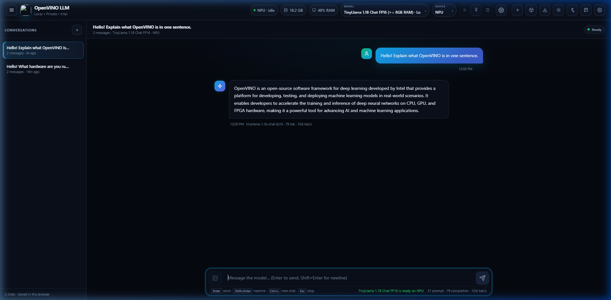
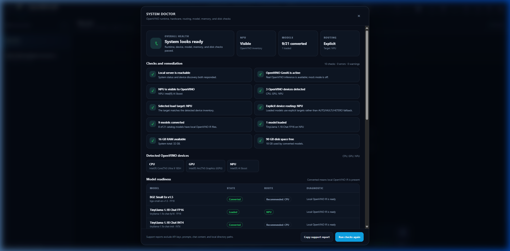
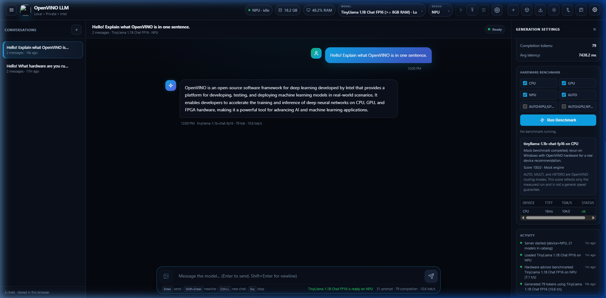
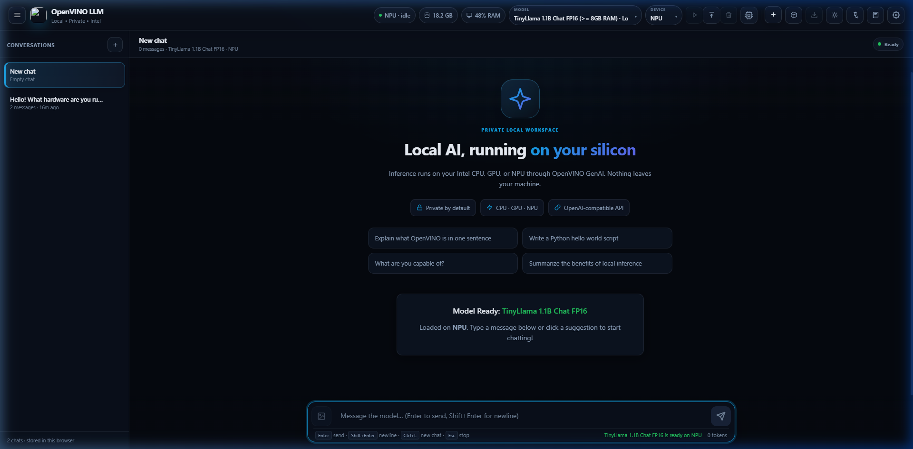
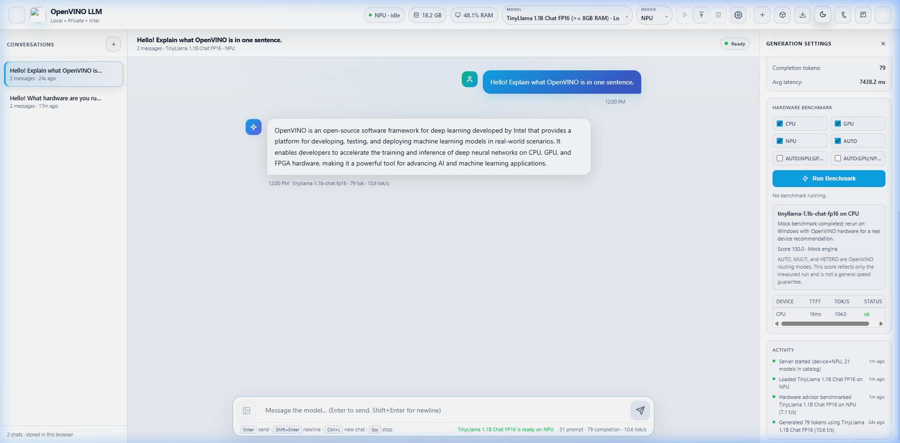
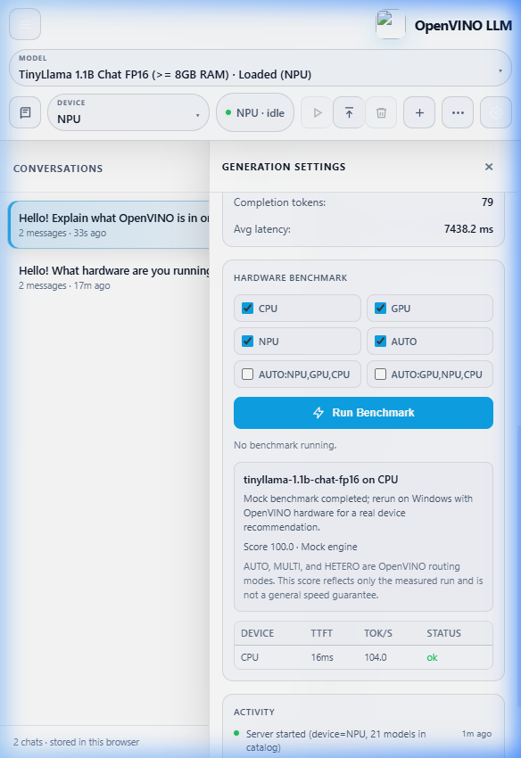

# InferBridge

## Video walkthrough

[▶ Watch the InferBridge walkthrough](https://youtu.be/rya6rJhkQrw)

**InferBridge turns Intel Windows PCs into local AI workstations.** It wraps OpenVINO GenAI in a Windows-first, OpenAI-compatible server with streaming chat, local vision chat, text embeddings, model lifecycle management, CPU/GPU/NPU device targeting, System Doctor hardware diagnostics, hardware benchmarking, a built-in browser UI, and a deterministic mock engine.

The project keeps OpenVINO as the inference runtime. It does not require Docker, cloud inference, Electron, or a Node frontend toolchain.

> **Validation status:** Mock-mode tests validate API, UI, packaging, and state contracts. Real CPU, GPU, and NPU claims require the Windows certification harness on suitable hardware with mock mode disabled. An unsigned development installer is not a signed production release.

## Latest release — 0.6.1 (stable)

**Current stable version: `0.6.1`.** This patch adds deterministic context-boundary and compiled-cache certification, fixes Windows conversion cancellation, and expands retained CPU/GPU evidence to Qwen 2.5 3B FP16 and TinyLlama 1.1B INT4.

**Current development version: `0.7.0`.** This branch rebrands the product as InferBridge while preserving OpenVINO GenAI, existing models and settings, legacy command-line interfaces, installer upgrade identity, and old/new update sources. No 0.7.0 release has been published.

Downloads (GitHub release `v0.6.1`; historical assets retain the original product filenames):

- [Windows installer (.exe)](https://github.com/Quazmoz/openvino-windows-llm/releases/download/v0.6.1/OpenVINO-Windows-LLM-0.6.1-windows-x64-installer.exe)
- [Portable ZIP](https://github.com/Quazmoz/openvino-windows-llm/releases/download/v0.6.1/OpenVINO-Windows-LLM-0.6.1-windows-x64-portable.zip)
- [SHA-256 checksums](https://github.com/Quazmoz/openvino-windows-llm/releases/download/v0.6.1/OpenVINO-Windows-LLM-0.6.1-checksums.txt)

References: [compatibility matrix](docs/COMPATIBILITY_MATRIX.md) · [expanded certification evidence](docs/certification/0.6.1/expanded-coverage-issue17/)

**Validation scope.** All evidence comes from a single Intel Core Ultra 9 185H laptop (Windows 11 build 26200) running OpenVINO `2026.2.1`. TinyLlama 1.1B, SmolLM2 135M, and Qwen2.5 1.5B — all FP16 — passed the full API contract on CPU, GPU, NPU, and AUTO, and BGE-Small embeddings passed on CPU. This is not a claim of support for all Intel systems.

> ⚠️ **The installer and portable ZIP are not Authenticode-signed.** Windows SmartScreen will warn on first launch. Verify your download against the published SHA-256 checksums before running.

Support remains specific to your hardware, model, driver, and OpenVINO version: a PASS on the machine above does not guarantee the same result on other Intel CPUs, GPUs, NPUs, drivers, or OpenVINO releases.

## Download → Install → Choose recommended model → Chat

The P0 desktop distribution is a thin Windows launcher around the existing FastAPI server and browser UI.

1. Download a versioned portable ZIP or installer artifact.
2. Run `InferBridge.exe` from the extracted package or Start Menu.
3. Review the hardware and OpenVINO system scan.
4. Confirm whether an Intel NPU is usable or select the offered CPU/GPU fallback.
5. Accept the conservative model recommendation or choose another compatible model.
6. Confirm license, disk, and warning information before download.
7. Follow separate download, conversion, validation, compilation, loading, and benchmark stages.
8. Continue directly to chat and copy the actual OpenAI-compatible endpoint.

The launcher binds to `127.0.0.1`, safely selects an available local port, waits for liveness and readiness, opens the browser, and avoids duplicate instances. Model weights are downloaded separately and are not included in the base installer.

The first model setup can take significant time. NPU support depends on the actual Intel platform, driver, model, and OpenVINO release. A requested device is not proof of execution. The wizard reports the actual device from successful measured generation.

## Installation options

### Windows installer

The Inno Setup configuration installs per-user under `%LOCALAPPDATA%\Programs\InferBridge`, creates a Start Menu shortcut, optionally creates a desktop shortcut, and preserves models and user data by default during upgrades and uninstall.

See [Windows installer guide](docs/INSTALLER.md).

### Portable ZIP

Extract the ZIP to a writable directory and run `InferBridge.exe`. Portable mode stores mutable data under a sibling `data` directory.

See [portable package guide](docs/PORTABLE.md).

### Source/developer setup

Windows remains the primary source-development target:

```powershell
git clone https://github.com/Quazmoz/InferBridge.git
cd InferBridge
.\setup.bat
.\start_server.bat --mock
```

For a real converted model:

```powershell
.\start_server.bat `
  --model tinyllama-1.1b-chat-fp16 `
  --device CPU `
  --auto-convert
```

Use `NPU`, `GPU`, or `AUTO` only when OpenVINO reports the target:

```powershell
.\start_server.bat --check-devices
```

## Visual preview

The screenshots below demonstrate the application running live OpenVINO GenAI inference on Intel hardware (CPU, GPU, and NPU).

### Main chat interface



### Hardware diagnostics and System Doctor



### Settings and system information



### First-run model flow



### Light theme



### Responsive layout



## Documentation

- [Quick start](QUICKSTART.md)
- [First-run guide](docs/FIRST_RUN.md)
- [Windows installer](docs/INSTALLER.md)
- [Portable package](docs/PORTABLE.md)
- [Desktop architecture](docs/DESKTOP_ARCHITECTURE.md)
- [Desktop onboarding API](docs/DESKTOP_API.md)
- [Mutable data paths](docs/DATA_PATHS.md)
- [Packaging and release](docs/PACKAGING_RELEASE.md)
- [Code signing](docs/CODE_SIGNING.md)
- [Desktop troubleshooting](docs/TROUBLESHOOTING_DESKTOP.md)
- [Windows setup](docs/WINDOWS.md)
- [Windows hardware certification](docs/WINDOWS_CERTIFICATION.md)
- [API contract](docs/API_CONTRACT.md)
- [Local vision chat](docs/VISION.md)
- [Open WebUI and n8n integrations](docs/INTEGRATIONS.md)
- [Device support](docs/DEVICE_SUPPORT.md)
- [Experimental Linux overview](docs/LINUX.md)

## Implemented capabilities

### Inference and compatibility

- OpenVINO GenAI text generation on `CPU`, `GPU`, `NPU`, `AUTO`, and advanced composite target expressions (`AUTO:NPU,GPU,CPU`, `MULTI:NPU,GPU,CPU`, `HETERO:NPU,GPU,CPU`)
- `POST /v1/chat/completions` with streaming and non-streaming responses
- `POST /v1/responses` with streaming and non-streaming output
- `POST /v1/embeddings` supporting catalog embedding models (e.g., `bge-small-en-v1.5`)
- OpenAI-compatible image content parts for local vision chat (`openvino-vlm` models)
- Stop sequences, seed, temperature, top-p, token limits, tool-call compatibility, and structured output fields
- Safe-by-default Hugging Face conversion with remote code execution disabled unless explicitly permitted for reviewed models

### Model and device operations

- Model catalog and custom Hugging Face model registration
- Actionable **System Doctor** hardware diagnostics covering OpenVINO runtime, device enumeration, explicit/fallback routing, memory, disk, and model readiness
- Background conversion with sanitized progress tracking and cancellation support
- Optional on-demand conversion upon model load
- Load, unload, delete, cancellation, and serialized lifecycle locks
- OpenVINO hardware discovery, system scan, and NPU readiness checks
- Local benchmark persistence with automated target recommendation profiles

### Desktop distribution

- Hidden-console Windows launcher with loopback port binding (`127.0.0.1`)
- Per-user single-instance lock with live nonce verification
- Bounded liveness (`/health/live`) and readiness (`/health/ready`) polling
- Safe loopback port fallback and duplicate-instance prevention
- User-visible startup dialogs, system tray integration, and rotating logs
- Privacy-safe diagnostic ZIP export for issue reporting
- Installed (`%LOCALAPPDATA%`) and portable (`<dir>\data`) writable path strategies
- Versioned onboarding state with automatic corruption recovery
- Conservative hardware recommendation engine and explicit NPU readiness verification
- Connection code generation for OpenAI Python SDK, environment variables, Open WebUI, and n8n
- PyInstaller executable packaging, portable ZIP staging, Inno Setup per-user installer, SHA-256 checksum manifests, and Authenticode signing gate

### Browser UI

- Responsive local chat with browser-stored conversation history
- Dynamic light and dark theme switching
- Model selection, device targeting, load, unload, and deletion controls
- Built-in **System Doctor** modal for comprehensive 10-point hardware diagnostic checks and privacy-safe support report copying
- Integrated **Hardware Benchmark** tool with multi-device performance comparison (TTFT, tok/s) and target recommendations
- Dependency-free Markdown rendering, syntax highlighting, and one-click code block copying
- Real-time token metrics (tok/s, prompt/completion tokens), system resource telemetry (RAM/Disk), and request latency
- First-run onboarding wizard with accessible keyboard navigation and visible live progress

## Data paths

Installed mode uses:

```text
%LOCALAPPDATA%\InferBridge
```

Portable mode uses:

```text
<portable directory>\data
```

Configuration, logs, models, Hugging Face cache, OpenVINO compiled cache, benchmarks, diagnostics, and onboarding state are separated. Normal upgrades and uninstall preserve this data unless the user explicitly requests removal.

Existing environment overrides remain supported:

```text
OV_LLM_DATA_DIR
OV_LLM_MODELS_FILE
OV_LLM_MODELS_DIR
OV_LLM_CACHE_DIR
OV_LLM_BENCHMARK_RESULTS
```

See [mutable data paths](docs/DATA_PATHS.md).

## API overview

```text
GET    /                         Built-in chat UI
GET    /health                   Runtime and lifecycle summary
GET    /health/live              Liveness probe
GET    /health/ready             Readiness probe

GET    /v1/models                OpenAI-style model list
POST   /v1/chat/completions      Chat, streaming or non-streaming
POST   /v1/responses             Responses API, streaming or non-streaming
POST   /v1/embeddings            Float or base64 embeddings

POST   /v1/models/register       Register a custom catalog model
POST   /v1/models/convert        Convert a catalog model
POST   /v1/models/load           Load a model
POST   /v1/models/unload         Unload a model
POST   /v1/models/delete         Delete an unloaded model

GET    /v1/devices               Device discovery
GET    /v1/system/status         Telemetry, models, progress, metrics, events
POST   /v1/benchmarks/run        Run hardware benchmarks
GET    /v1/benchmarks            List saved benchmark runs

GET    /v1/onboarding/status
GET    /v1/onboarding/system-scan
GET    /v1/onboarding/npu-readiness
GET    /v1/onboarding/recommendation
POST   /v1/onboarding/prepare
GET    /v1/onboarding/preparation/{job_id}
POST   /v1/onboarding/preparation/{job_id}/cancel
POST   /v1/onboarding/complete
POST   /v1/onboarding/restart
GET    /v1/onboarding/connection
```

State-changing routes follow the existing API-key policy when `OV_LLM_API_KEY` is configured. Connection examples never return the actual secret.

## Configuration

```powershell
$env:OV_LLM_HOST = "127.0.0.1"
$env:OV_LLM_PORT = "8000"
$env:OV_LLM_DEVICE = "CPU"
$env:OV_LLM_MODEL = "tinyllama-1.1b-chat-fp16"
$env:OV_LLM_AUTO_CONVERT = "1"
$env:OV_LLM_API_KEY = ""
$env:OV_LLM_CORS_ORIGINS = ""
$env:OV_LLM_RATE_LIMIT = "0"
$env:OV_LLM_MOCK = ""
$env:HF_TOKEN = ""
```

Keep the host at `127.0.0.1` unless LAN access is deliberate and protected. The server is not a hardened public gateway.

## Device behavior

Simple targets:

- `CPU`
- `GPU`
- `NPU`
- `AUTO`

Accepted advanced examples include `AUTO:NPU,GPU,CPU`, `MULTI:NPU,GPU,CPU`, and `HETERO:NPU,GPU,CPU`. Composite routing is experimental and does not guarantee additive performance.

OpenVINO discovery is the source of truth. Real support claims require the Windows certification harness.

## Model catalog

`models.json` describes model source, OpenVINO backend, output path, precision, recommended device, context, output limits, and remote-code policy. Catalog recommendations are starting points, not certification.

The desktop distribution copies the bundled catalog into writable configuration. Existing user entries are retained during upgrades. New entries use the writable model directory. Existing models are not silently moved or deleted.

## Build and validate a Windows distribution

```powershell
.\scripts\build_windows_distribution.ps1
.\scripts\smoke_test_packaged.ps1 -DistributionPath .\dist\InferBridge
```

The build script produces a versioned portable ZIP and, when Inno Setup is available, a per-user installer. It generates SHA-256 checksums and labels unsigned builds accurately.

The packaged smoke test uses mock mode and verifies startup, readiness, static UI, onboarding, model preparation, benchmark, Chat Completions, Responses API, streaming, portable paths, and controlled shutdown. It does not validate real CPU, GPU, NPU, model conversion, or Authenticode signing.

## Development and testing

```bash
pip install -e .[dev]
ruff check .
ruff format --check .
pytest
```

External mock contract validation:

```bash
OV_LLM_MOCK=1 python -m app.server --mock --host 127.0.0.1 --port 8123 --model tinyllama-1.1b-chat-fp16
python scripts/validate_api_contract.py --base-url http://127.0.0.1:8123 --profile full --expect-mock --include-embeddings --run-benchmark --exercise-lifecycle
```

Real hardware evidence:

```powershell
.\scripts\validate_windows.ps1
```

## Experimental Linux

```bash
git clone https://github.com/Quazmoz/InferBridge.git
cd InferBridge
chmod +x setup.sh start_server.sh setup/*.sh setup/linux/*.sh
./setup.sh --minimal
./start_server.sh --mock
./start_server.sh --model tinyllama-1.1b-chat-fp16 --device CPU
```

Linux GPU and NPU support remains driver-dependent and experimental.

## Security and privacy

- localhost is the safe default
- state-changing routes can require the configured API key
- CORS is opt-in
- progress and errors sanitize secrets and full private paths
- onboarding does not persist prompts or chat content
- connection examples use placeholders instead of disclosing configured keys
- model and conversion work remains serialized
- incomplete new conversion output is not presented as valid
- no certificates, private keys, passwords, or signing secrets belong in the repository

Conversation data remains in browser localStorage and is not persisted by the server.

## License

MIT. See [LICENSE](LICENSE).
